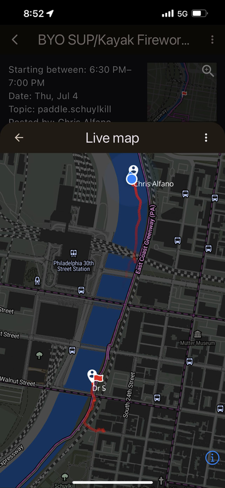
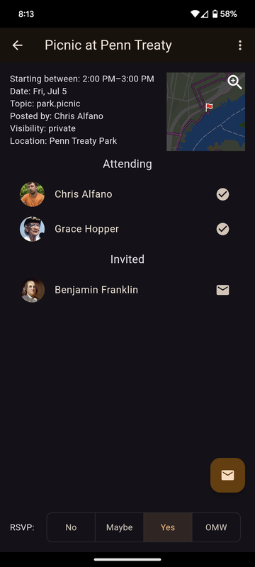
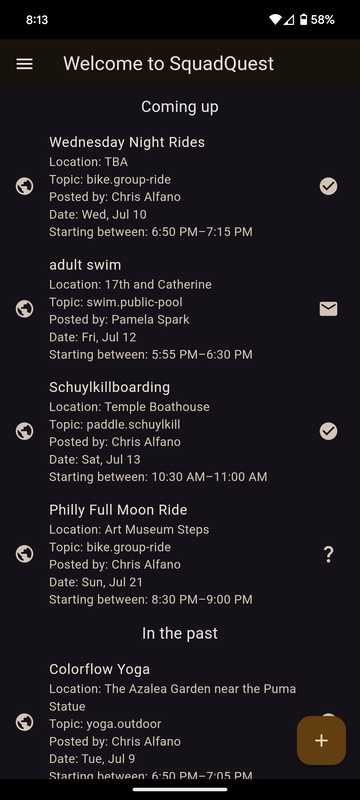
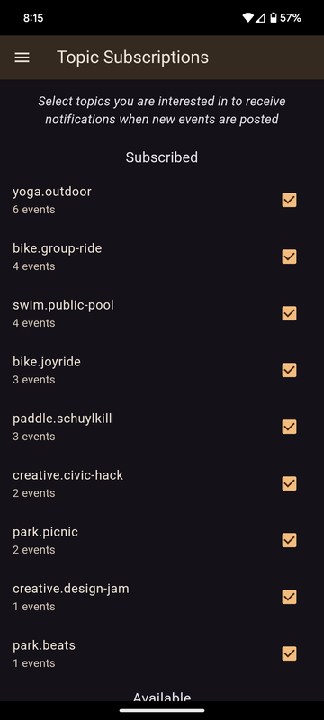
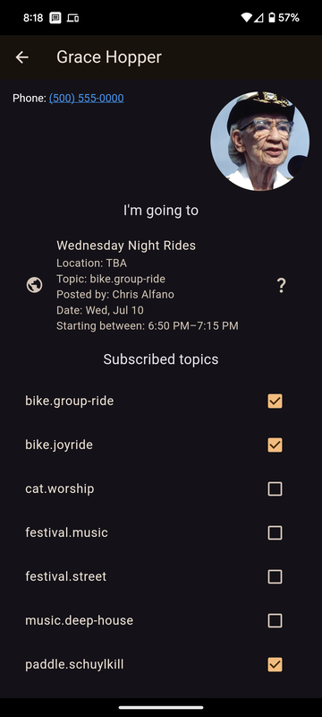

# SquadQuest

Bring your social circle to life with SquadQuest: the free, privacy-first app for planning real-world hangouts.

- [What is SquadQuest?](#what-is-squadquest)
- [Screenshots](#screenshots)
- [Features](#features)
- [Install](#install)
- [Development Setup](#development-setup)
    - [Prerequisites](#prerequisites)
    - [Setting up the project](#setting-up-the-project)
    - [Running the app](#running-the-app)
    - [Testing Beta Releases](#testing-beta-releases)
- [Roadmap](#roadmap)

## What is SquadQuest?

SquadQuest aims to be the painless way to rally your friends to do stuff together IRL.

SquadQuest *is not* a social network. Social networks help you build shallow connections with people you don't really know. You will not see people on SquadQuest that you don't already know and they won't see you. SquadQuest is designed to help you spend more time out in the real world with people you know.

SquadQuest *is not* a startup. The need to monetize your data or engagement to return investment to VCs is why nothing like SquadQuest exists already. SquadQuest couldn't do it's job as well as it possibly could if those concerns had to take precedence. We're building SquadQuest because we want it to exist and we want it to be as useful as possible. SquadQuest is built by its users, *for* its users. At some point we will likely accept donations to support operating costs, but for now the focus is on keeping operating costs as low as possible.

*Who is Jarvus Innovations?* Jarvus is the open-source civic technology consultancy that SquadQuest's original author helps run. SquadQuest is published under Jarvus' developer accounts in the Google and Apple app stores because it's a pain to set those up without a business entity and Jarvus already had them. Eventually SquadQuest will be transfered to its own developer accounts or those of a nonprofit custodian.

## Screenshots

<p float="left">
    
    
    
    
    
</p>

## Features

- Log in with just your phone number
- Find and post events/gatherings
- Connect with friends via their phone numbers
- Build a list of event topics you're interested in subscribing to
- Get alerted when public or friends-only events are posted that match your interests
- Post private events and only invite specific people
- Keep track of who's coming, who's on the fence, and who's on their way in real time
- Keep track of where your squad is and how they're moving on a live map for each event
- Keep your squad up-to-date on when and where on the map you're rallying together

## Install

- [via App Store for Apple mobile devices](https://apps.apple.com/us/app/squadquest/id6504465196)
- [via Play Store for Android mobile devices](https://play.google.com/store/apps/details?id=app.squadquest)
- Use SquadQuest in your browser: <https://squadquest.app>

## Development Setup

This project uses [asdf](https://asdf-vm.com/) for managing tool versions, including Flutter.

### Prerequisites

1. Install asdf following the [installation guide](https://asdf-vm.com/guide/getting-started.html)
2. Install the Flutter plugin for asdf:

   ```bash
   asdf plugin add flutter
   ```

### Setting up the project

1. Clone the repository
2. Navigate to the project directory
3. Install the required Flutter version using asdf:

    ```bash
    asdf install
    ```

    This will automatically install Flutter 3.29.3 as specified in the `.tool-versions` file.

4. Verify the installation:

    ```bash
    flutter --version
    ```

5. Install dependencies:

    ```bash
    flutter pub get
    ```

6. Obtain secrets:

    Production versions of these are all available in the SquadQuest vault.

    For development, you'll need to [run your own Supabase instance](supabase/docker-compose.yml) and provision an app with FCM access in Firebase:

    - `android/app/google-services.json`: Obtained from Firebase
    - `{ios,macos}/Runner/GoogleService-Info.plist`: Obtained from Firebase
    - `.env`: Copy `.env.example` and fill in details for development Supabase instance

### Running the app

```bash
flutter run
```

### Testing Beta Releases

- [Install latest Beta release for Apple mobile devices via TestFlight](https://testflight.apple.com/join/1xppwmKm)

    Updating: You'll get alerts from the TestFlight app when new Beta versions are available to install

- [Install latest Beta release for Android mobile devices via APK download](https://github.com/SquadQuest/SquadQuest/releases/latest/download/SquadQuest.apk)

    Updating: Installing this way requires manual updates to get new versions by coming back here and clicking this link again

## Roadmap

Some major milestones currently envisioned include:

### Upcoming

- **SMS Integration**: Invite friends more easily by sending friend requests or event invitations to people who aren't on SquadQuest yet through SMS
- **Calendar Integration**: See the events you're going to right in the mobile calendar you already use
- **Chat**: Chat rooms for events that hosts can pin announcements to
- **Photo Album**: Upload photos to an event that participants can download individually or all at once to their phone
- **Polling**: Ping friends about potential event to find out what times might work for everyone
- **Smart Event Suggestions**: Tell SquadQuest what you want to do more of and it'll keep an eye out for times that you and friends with the same interest have room on your calendar

### Complete

- **Rally Point Search**: Search for rally points by name and pick from results instead of only being able to drag a pin around
- **Interest-based Push Notifications**: Get configurable automatic push notification alerts when friends or public organizers post events matching your interests
- **Live Friends Map**: See where friends on their way to or at the same event live on a map with trails that show you which way and how fast they're going
- **Event Map Pin**: Attach a pinned location on a map to an event
- **Cancel Events**: Set an event you created to cancelled and alert everyone who RSVPed
- **Editing Events**: Make changes to events you already posted
- **Topic Subscription**: Maintain a list of topics you're interested in seeing and getting alerted about new events under
- **Native Android and iOS app**: Install SquadQuest from app stores for the smoothest possible experience (beta links available above)
- **Live Map**: See a live map under each event showing the event's pinned location and live markers for every attendee who has switched their RSVP to OMW
- **Push Notifications**: Get instant notifications when you're outside the app when you receive a friend request, an event invitation, or someone RSVPs to an event you posted
- **Realtime Updates**: Screens update in real time when anything gets changed by someone else
- **Event Invitations**: Send invitations to friends for any event you can see
- **RSVPs**: Set and update your RSVP status to events as no, maybe, yes, or OMW
- **Events**: Post events that can be visible publically, only to your friends, or only to people you directly invite.
- **Buddy List**: Build a list of friends you connect with by their phone number. Friend connections have to be accepted on the other end and then are mutual
- **Identity**: Log in with just your mobile phone number
- **Homescreen App**: Install SquadQuest to your home screen from the web app for an improved experience
- **Web App**: Use SquadQuest directly in your browser without installing anything
